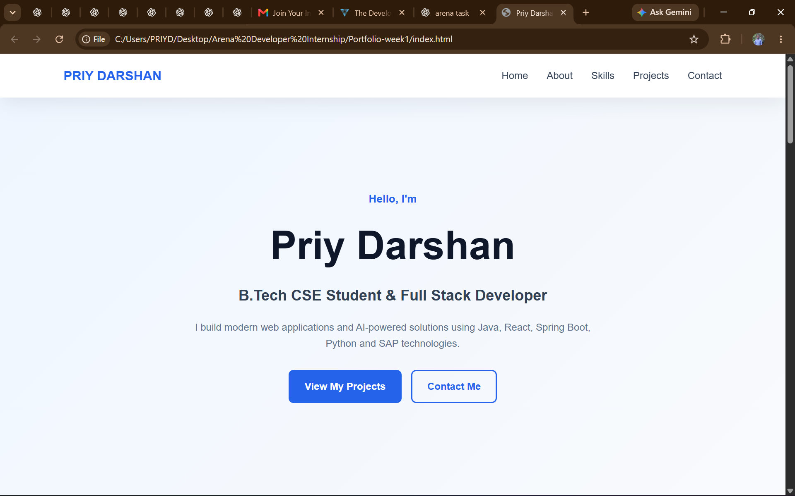
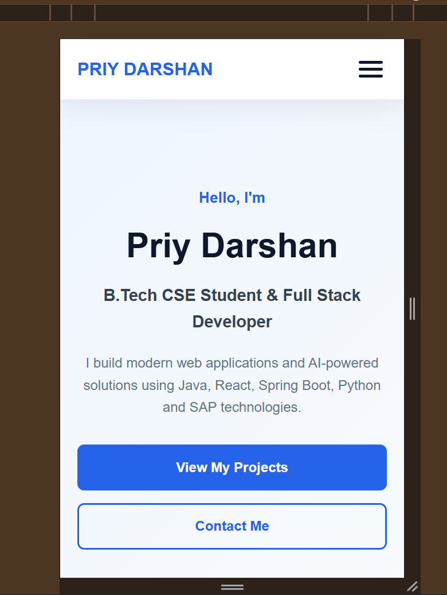
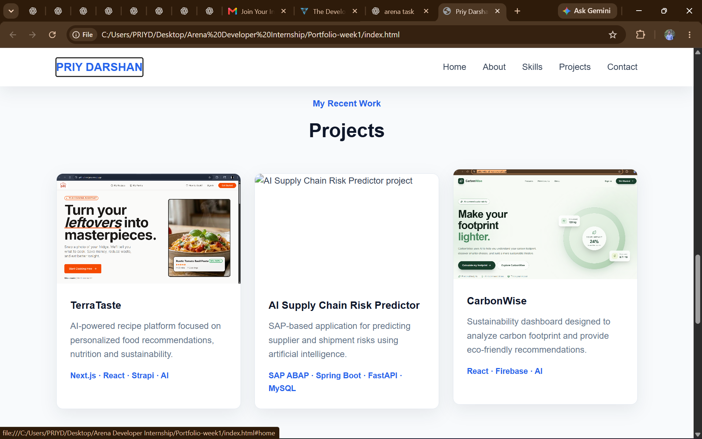
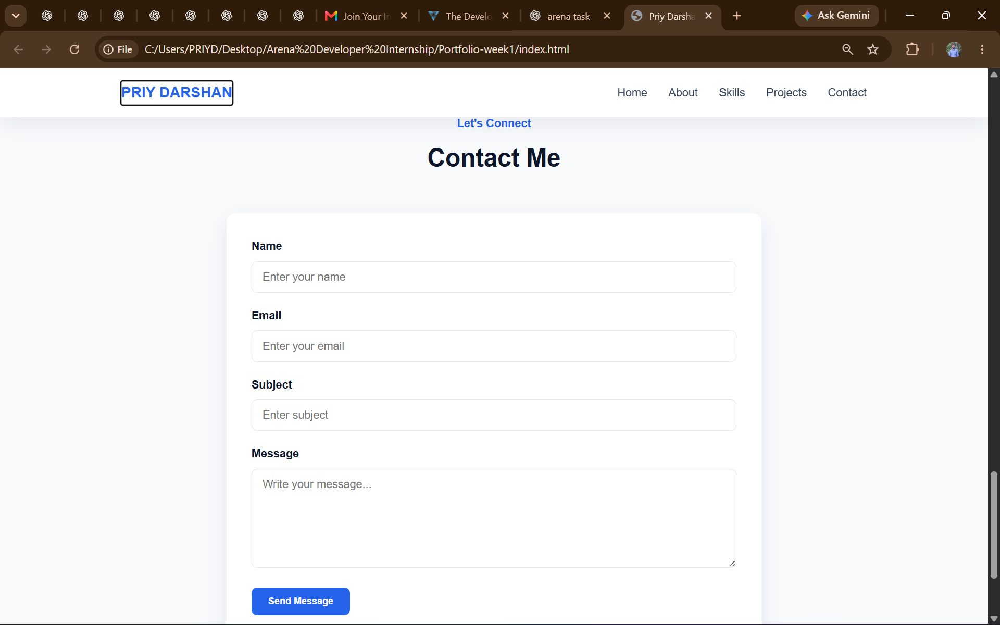

# Personal Portfolio Website

## 📌 Project Description

A responsive personal portfolio website created as part of **Week 1: HTML & CSS Foundations**. The website showcases my skills, projects, and contact information.

## ✨ Features

* Responsive design for desktop, tablet, and mobile
* Semantic HTML5 structure
* CSS Grid and Flexbox
* Responsive navigation with mobile menu
* Contact form with basic validation
* Hover effects and CSS transitions
* Accessible navigation and image alt attributes

## 🛠️ Technologies Used

* HTML5
* CSS3
* JavaScript
* Git & GitHub
* VS Code

## 📁 Project Structure

```text
Portfolio-week1/
├── index.html
├── css/
│   ├── style.css
│   ├── responsive.css
│   └── variables.css
├── js/
│   └── navigation.js
├── images/
├── README.md
└── .gitignore
```

## ⚙️ Setup Instructions

1. Clone or download the project.
2. Open the `Portfolio-week1` folder in VS Code.
3. Open `index.html`.
4. Run it using **Live Server** or directly in a browser.

## 🔧 Technical Details

* **HTML5:** Semantic structure using header, nav, main, section, article and footer.
* **CSS3:** Variables, Box Model, Flexbox, Grid and Media Queries.
* **JavaScript:** Mobile navigation functionality.
* **Responsive Design:** Layout adapts to desktop, tablet and mobile screens.
* **Accessibility:** Alt attributes, labels and ARIA attributes are used.

## 🧪 Testing

The website was tested for:

* Desktop, tablet and mobile responsiveness
* Navigation functionality
* Mobile hamburger menu
* Contact form validation
* Image accessibility
* Different modern browsers

## 📸 Screenshots

Screenshots of the desktop, tablet, mobile and contact form views are included as project documentation.
## 📸 Screenshots

### Desktop View



### Tablet View



### Project View



### Contact Form



## 👨‍💻 Author

**Priy Darshan**

GitHub: https://github.com/PRIYDARSHANGLBITM

LeetCode: https://leetcode.com/u/priydarshan197358/
