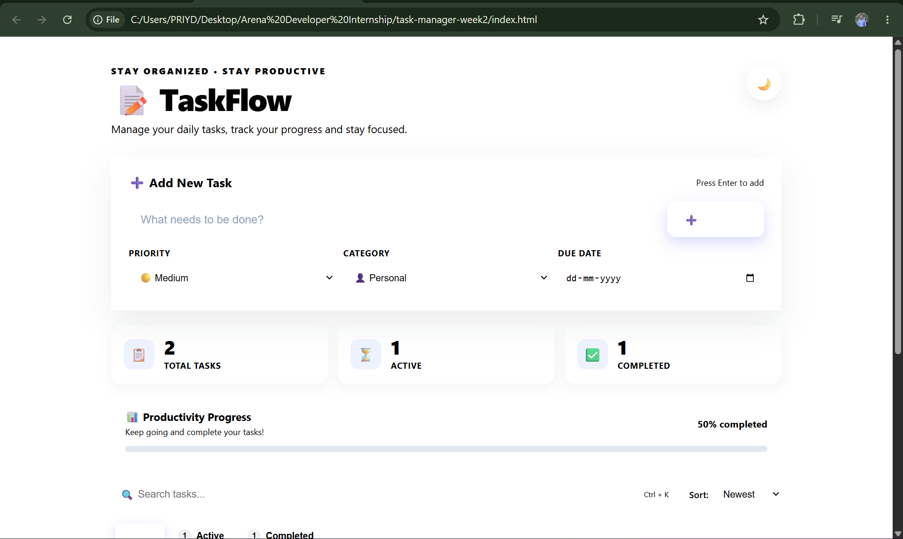
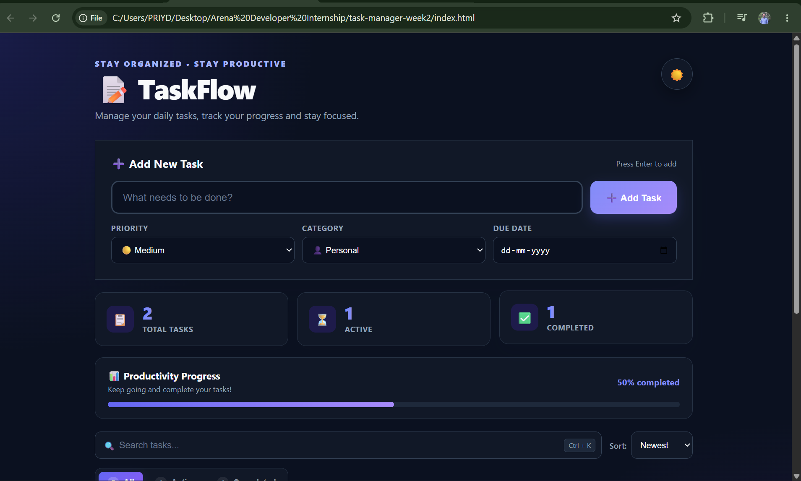
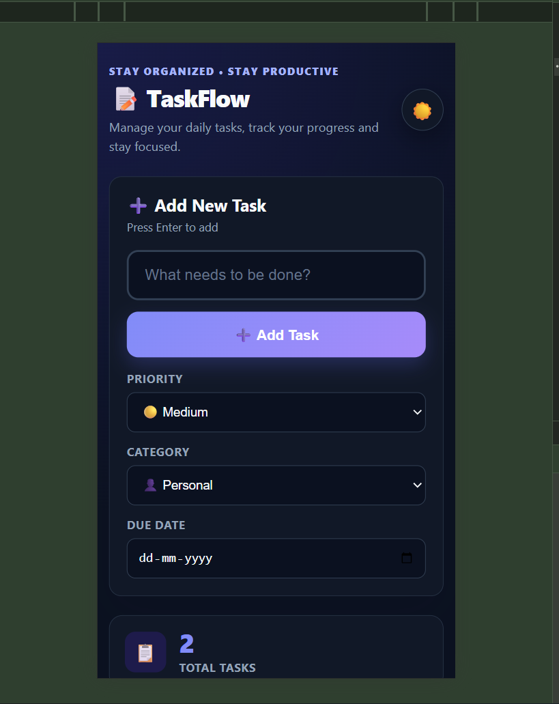
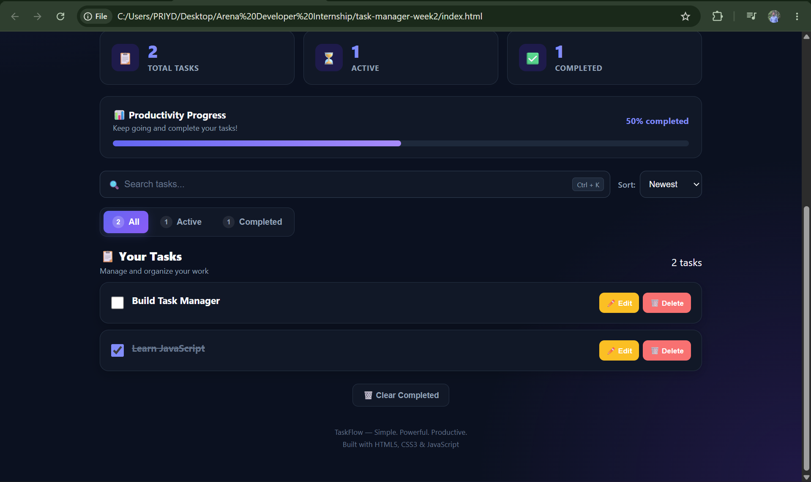

# 🚀 Interactive Task Manager

A modern, responsive and user-friendly **Task Management Web Application** built using **HTML5, CSS3 and Vanilla JavaScript**.

TaskFlow helps users organize daily tasks, track progress, search and sort tasks, manage priorities and categories, and maintain their tasks even after refreshing the browser using `localStorage`.

---

## 🌐 Live Demo

🔗 **Live Demo:**  
https://YOUR-LIVE-DEMO-LINK.com

> Replace the above link with your GitHub Pages / Netlify / Vercel deployment link.

---

## 📸 Screenshots

### 🖥️ Desktop View



### 🌙 Dark Mode



### 📱 Mobile Responsive View



### 🔎 Search & Filter



> **Note:** Add your screenshots inside the `screenshots/` folder using the exact names mentioned above.

---

# ✨ Features

## 📝 Task Management

- ➕ Add new tasks
- ✏️ Edit existing tasks
- 🗑️ Delete tasks
- ✅ Mark tasks as completed
- 🔄 Mark completed tasks as active
- 🧹 Clear all completed tasks

---

## 🎯 Task Organization

Each task can contain:

- 🔴 High Priority
- 🟡 Medium Priority
- 🟢 Low Priority
- 👤 Personal
- 💼 Work
- 📚 Study
- 🛒 Shopping
- ❤️ Health
- 📅 Due Date

---

## 🔍 Search

Quickly find tasks using the built-in search functionality.

- Real-time task searching
- Case-insensitive search
- Search works with task text
- `Ctrl + K` shortcut to focus search
- `Esc` shortcut to clear search

---

## 🔃 Sorting

Tasks can be sorted using multiple options:

- 🆕 Newest First
- 🕐 Oldest First
- 🔴 Priority
- 📅 Due Date
- 🔤 Alphabetical

---

## 🗂️ Task Filters

Filter tasks based on their current status:

| Filter | Description |
|---|---|
| 📋 All | Shows all tasks |
| 🔵 Active | Shows pending tasks |
| ✅ Completed | Shows completed tasks |

Each filter also displays the current task count.

---

## 📊 Task Statistics

TaskFlow provides real-time statistics:

- **Total Tasks**
- **Active Tasks**
- **Completed Tasks**

The statistics automatically update whenever a task is added, deleted or completed.

---

## 📈 Progress Tracking

A dynamic progress bar shows the percentage of completed tasks.

Example:

```text
Completed: 75%
██████████████████░░░░░